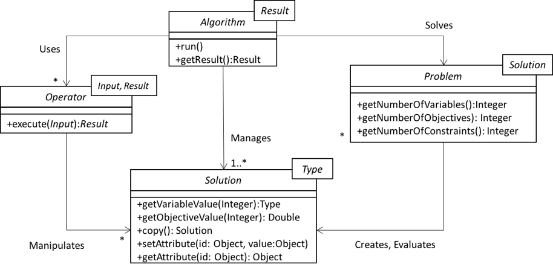
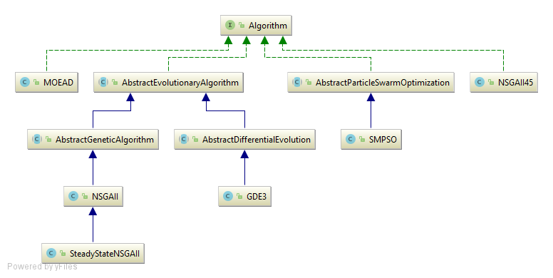

<!--<div id='id-architecture'/>-->
## アーキテクチャ

jMetal5のアーキテクチャは4つのインターフェースに依存している．



この図はjMetalによって提供される典型的な機能を補足している．アルゴリズムはいくつかの`Operators`を使用して潜在的な`Solution`オブジェクトのセットを操作することによって`Problem`を解決する．`Solution`インターフェースは進化的アルゴリズムの個体と，粒子群最適化アルゴリズム(PSO)の場合の粒子を表す．`Problem`は新しい解決策を作り，それを評価する．

以前のバージョンのjMetalと比較すると，Population(人口)やSwarm(集団)という概念のクラスはない．jMetal5では，人口は単にソリューションのリストにすぎない．(Javaの`List<Solution>`)

### Generics(ジェネリクス)
現在広く使われているJava Genericsの使用をモデル化するために，パラメータ化された型の使用を見ることができる．

アーキテクチャでGenericsを利用することで，全てのコンポーネントをメタヒューリスティックに整列させることができ，Javaコンパイラが全て合っているかどうかを確認することができる．例えば，このコードは，継続的な問題を解決するためによく知られているNSGA-IIアルゴリズムを構成するための全ての要素を表す．

```java
    Problem<DoubleSolution> problem;
    Algorithm<List<DoubleSolution>> algorithm;
    CrossoverOperator<DoubleSolution> crossover;
    MutationOperator<DoubleSolution> mutation;
    SelectionOperator<List<DoubleSolution>, DoubleSolution> selection;

    ...

    algorithm = new NSGAIIBuilder<DoubleSolution>(problem, crossover, mutation)
        .setSelectionOperator(selection)
        .setMaxEvaluations(25000)
        .setPopulationSize(100)
        .build() ;
```

### `Algorithm`関連クラスの階層
`Algorithm`クラスは非常に簡単で，次のコードスニペットに示すように`run()` y `getResult()`という2つのメソッドしかない．

```java
package org.uma.jmetal.algorithm;

/**
 * Interface representing an algorithm
 * @author Antonio J. Nebro
 * @version 0.1
 * @param <Result> Result
 */
public interface Algorithm<Result> extends Runnable, Serializable, DescribedEntity {
  void run() ;
  Result getResult() ;
}

```

jMetal5には，次の図に示すように，`Algorithm`を継承するクラスの階層が含まれている．



一方では，すでに提供されているコードを再利用することによってアルゴリズムの実装を容易にするために使用できるものよりも，テンプレートを構成する抽象クラスのレベル(`AbstractEvolutionaryAlgorithm`か`AbstractParticleSwarmOptimization`)が見つかった．一方，MOEA/DとNSGA-II45の2つのアルゴリズムの例を見ることができる．これにより，自分で新しいアルゴリズムを実装したり，既存のクラスを拡張したりすることができる．

NSGA-IIの場合，`AbstractGeneticAlgorithm`を継承している．これは`AbstractEvolutionaryAlgorithm`のサブクラスである．この図は，NSGA-IIの定常状態の変形がNSGA-IIクラスを拡張することによって定義できることを示している．
