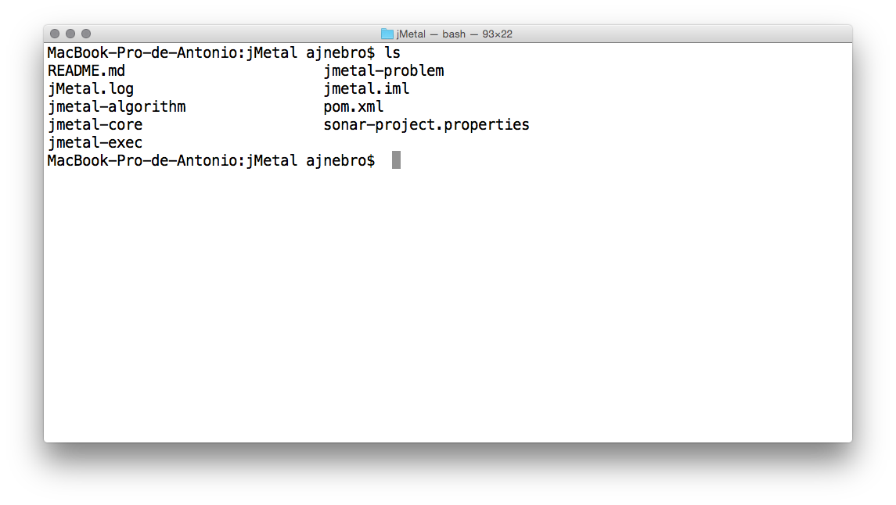

## コンパイル
jMetalのソースコードを取得したら，IDEまたは端末のコマンドラインから使用できる．IDEの代替として単純で，ツールに慣れていればアルゴリズムのコンパイルと実行は簡単である．

### Intellj Idea
プロジェクトをビルドするには`Build`→`Make Project`を選択する

### Eclipse
`Project`→`Build Automatically`が設定されるとEclipseは自動的にプロジェクトをビルドする．それ以外の場合は`Project`→`Build Project`を選択する．

### Netbeans
Netbeansでは`Run`→`Build Project`を選択する必要がある．

### コマンドラインからのビルド
ソースコードをダウンロードしたら，Mavenコマンドを使ってプロジェクトをビルドすることができる．Terminalを開くと次のようになる．

Mavenの使い方

- `mvn clean`: プロジェクトのクリーニング
- `mvn compile`: コンパイル
- `mvn test`: テスト
- `mvn package`: コンパイル，テスト，ドキュメントの作成，jarファイルのパッケージ化
- `mvn site`: プロジェクトのサイトを生成する

[2.3 プログラムの実行](running.md)
