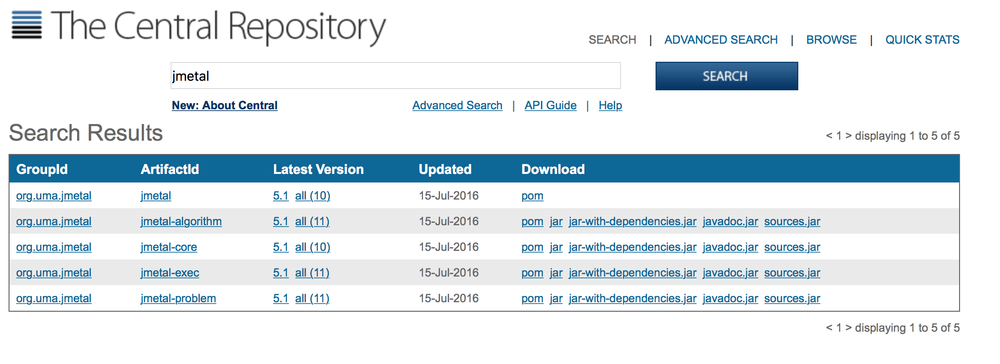
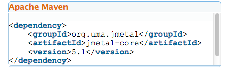

<!--<div id='id-installation'/>-->
## インストール
jMetalはGithubでホストされているMavenプロジェクトであり，ソフトウェアをインストールする方法は2種類ある．
1. Mavenプロジェクトを依存関係で追加する
2. https://github.com/jMetal/jMetal から入手する

### jMetalをMaven/Gradle依存関係で使用する
jMetal5は4つのサブモジュールから構成されている．
- `jmetal-core`: コアアーキテクチャのクラスやいくつかのユーティリティ(品質尺度を含む)
- `jmetal-algorithm`: メタヒューリスティックの実装
- `jmetal-problem`: 問題の実装
- `jmetal-exec`: アルゴリズムといくつかのユーティリティを設定し実行するプログラム

これらのモジュールは[Central Repository](http://search.maven.org/)にある(最新バージョンはjMetal 5.6)．



ここから必要なMavenの依存関係を取得できる．例えば，`jmetal-core`でのクラスのいくつかを使いたい場合，この依存関係をプロジェクトの`pom.xml`に追加すれば良い．



Gradleの場合も同様に，build.gradleにMavenリポジトリがリストされて入れば良い．

```Groovy
repositories {
    mavenCentral()
}
```

Mavenのように同じモジュールを使用できる．例えば，コアモジュールとアルゴリズムモジュールに依存関係を追加するには，次のようにすればよい．

```Groovy
dependencies {
    compile (
            [group: 'org.uma.jmetal', name: 'jmetal-core', version: '5.2'],
            [group: 'org.uma.jmetal', name: 'jmetal-algorithm', version: '5.2']
    )
}
```

他のパッケージが必要な場合にも同じようにできる．

### Githubからソースコードを取得する
Githubにプロジェクトがあることの利点は，ソースコードをコピーするだけで簡単にその仕組みを使うことができることである．これはいくつかの方法で行うことができる．

- terminalのコマンドラインからGitを使用する．

```
git clone https://github.com/jMetal/jMetal.git
```

- https://github.com/jMetal/jMetal のページ右側にある "Open in Desktop"か"Download ZIP"を選択する

ソースコードを取得すれば，IDEを使用してプロジェクトをMavenプロジェクトとしてimport (Eclipse)かopen (Intellij Idea)したり，開く (Netbeans)ことができる．

[2.1 要件](requirements.md)
