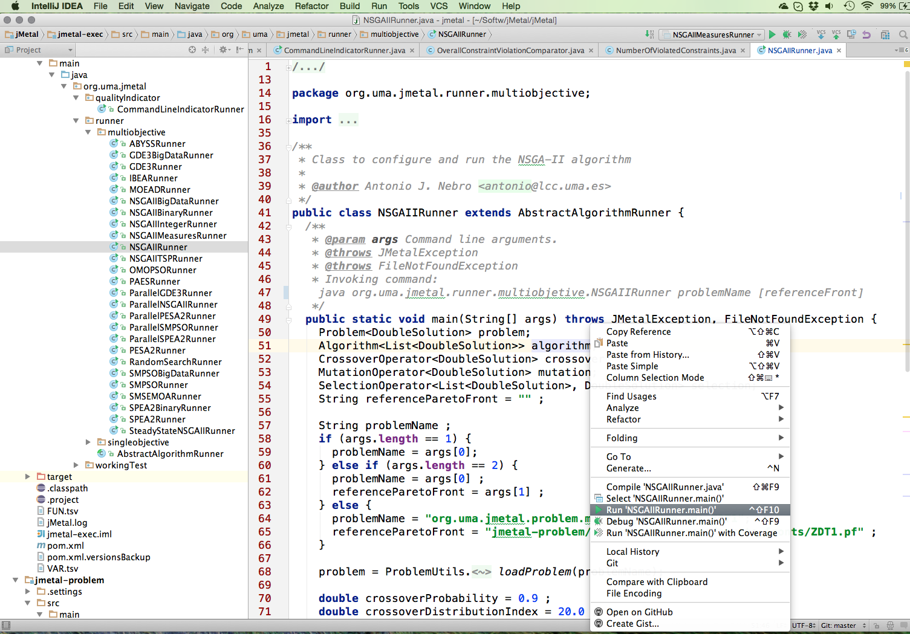

## アルゴリズムの実行
jMetalでアルゴリズムを実行するには，IDEを使用する方法とコマンドラインを使用する方法は2つある．このセクションでは，両方の方法について説明する．最初に問題を解決するためにメタヒューリスティックなアルゴリズムを構成する方法について説明する．

### アルゴリズムの設定
jMetal5ではアルゴリズムを設定して実行するために，クラスを書く必要がある．そのようなクラスをランナー(Runner)と呼ぶ．外部構成ファイルからアルゴリズムを構成する機能はまだ実装されていない．

jMetalに実装されている全てのアルゴリズムに少なくともRunnerクラスを提供する．`jmetal-exec`モジュールのフォルダ(https://github.com/jMetal/jMetal/tree/master/jmetal-exec/src/main/java/org/uma/jmetal/runner/multiobjective)にある．

例として，NSGA-Ⅱアルゴリズムの様々なRunnerや構成方法，使用方法を示す．

- `NSGAIIRunner`: 継続的な問題を解決するための標準NSGA-Ⅱの設定
- `NSGAIIIntegerRunner`: 整数問題を解決するための設定
- `NSGAIIBinaryRunner`: バイナリ問題を解決するための設定
- `NSGAIIMeasuresRunner`: `NSGAIIRunner`に似ているが,評価の使用例も含まれる
- `NSGAIIMeasuresWithChartsRunner`: `NSGAIIMeasuresRunner`に似ているが, アルゴリズム実行中のフロントの進化を示すグラフをプロットする．
- `NSGAIIStoppingByTimeRunner`: 与えられた評価数ではなく，あらかじめ定義された時間に基づいて停止条件を使用するようにNSGA-Ⅱを設定する方法を示す例である
- `ParallelNSGAIIRunner`: `NSGAIIRunner`と同じだが，並列で母集団を評価するスレッドを使用するように設定されている

次に`NSGAIIRunner`クラスについて説明する．Javadocコメントはプログラムのパラメータを示す．最初のパラメータは解決する問題のクラスである．2番目のパラメータはオプションのパラメータで，参照フロントを含むファイルへのパスを示す．このフロントは，解決すべき問題の最適なパレートフロントの近似であり，提供された場合，それは利用可能な全ての品質評価を計算するために使用される．

```java
public class NSGAIIRunner extends AbstractAlgorithmRunner {
  /**
   * @param args Command line arguments.
   * @throws JMetalException
   * @throws FileNotFoundException
   * Invoking command: java org.uma.jmetal.runner.multiobjetive.NSGAIIRunner problemName [referenceFront]
   */
  public static void main(String[] args) throws JMetalException, FileNotFoundException {
```

mainメソッドの最初の部分は，解決する問題のタイプ(この例は`DoubleSolution`個体を扱う問題)とオペレータを宣言する．`referenceParetoFront`はオプションの参照フロントの名前を示すのに使用される．

```java
    Problem<DoubleSolution> problem;
    Algorithm<List<DoubleSolution>> algorithm;
    CrossoverOperator<DoubleSolution> crossover;
    MutationOperator<DoubleSolution> mutation;
    SelectionOperator<List<DoubleSolution>, DoubleSolution> selection;
    String referenceParetoFront = "" ;
```
次の分のグループはプログラムの引数を解析する．引数が指定されていない場合のベンチマーク問題(ZDT1)はデフォルトで解決される．

``` java
    String problemName ;
    if (args.length == 1) {
      problemName = args[0];
    } else if (args.length == 2) {
      problemName = args[0] ;
      referenceParetoFront = args[1] ;
    } else {
      problemName = "org.uma.jmetal.problem.multiobjective.zdt.ZDT1";
      referenceParetoFront = "jmetal-problem/src/test/resources/pareto_fronts/ZDT1.pf" ;
    }
```

次にクラス名を使用して問題がロードされる．

```java
    problem = ProblemUtils.<DoubleSolution> loadProblem(problemName);
```

次にオペレータとアルゴリズムを構成する．

```java
    double crossoverProbability = 0.9 ;
    double crossoverDistributionIndex = 20.0 ;
    crossover = new SBXCrossover(crossoverProbability, crossoverDistributionIndex) ;

    double mutationProbability = 1.0 / problem.getNumberOfVariables() ;
    double mutationDistributionIndex = 20.0 ;
    mutation = new PolynomialMutation(mutationProbability, mutationDistributionIndex) ;

    selection = new BinaryTournamentSelection<DoubleSolution>(new RankingAndCrowdingDistanceComparator<DoubleSolution>());

    algorithm = new NSGAIIBuilder<DoubleSolution>(problem, crossover, mutation)
        .setSelectionOperator(selection)
        .setMaxEvaluations(25000)
        .setPopulationSize(100)
        .build() ;
```
最後のステップはアルゴリズムを実行し，得られた解を2つのファイルに書き込むことである．1つは変数地用，もう1つは客観値用です．任意選択的に，基準フロントが提供されている場合，計算結果に対する利用可能な全ての品質評価の値も表示される．

```java
    AlgorithmRunner algorithmRunner = new AlgorithmRunner.Executor(algorithm)
        .execute() ;

    List<DoubleSolution> population = algorithm.getResult() ;
    long computingTime = algorithmRunner.getComputingTime() ;

    JMetalLogger.logger.info("Total execution time: " + computingTime + "ms");

    printFinalSolutionSet(population);
    if (!referenceParetoFront.equals("")) {
      printQualityIndicators(population, referenceParetoFront) ;
    }
  }
```

### IDEからアルゴリズムを実行する
アルゴリズムを設定したら，好きなIDEを使用してアルゴリズムを実行することができる．たとえば，IntellJ Ideaの場合は，Runnerクラス名を選択し，NSGA-Ⅱを実行する場合は"Run 'NSGAIIRunner.main()'"オプションを選択する．



実行すると次のメッセージが出力コンソールに出力される．

```
jul 27, 2015 4:21:59 PM org.uma.jmetal.runner.multiobjective.NSGAIIRunner main
INFORMACIÓN: Total execution time: 1147ms
jul 27, 2015 4:21:59 PM org.uma.jmetal.runner.AbstractAlgorithmRunner printFinalSolutionSet
INFORMACIÓN: Random seed: 1438006918503
jul 27, 2015 4:21:59 PM org.uma.jmetal.runner.AbstractAlgorithmRunner printFinalSolutionSet
INFORMACIÓN: Objectives values have been written to file FUN.tsv
jul 27, 2015 4:21:59 PM org.uma.jmetal.runner.AbstractAlgorithmRunner printFinalSolutionSet
INFORMACIÓN: Variables values have been written to file VAR.tsv
jul 27, 2015 4:22:00 PM org.uma.jmetal.runner.AbstractAlgorithmRunner printQualityIndicators
INFORMACIÓN:
Hypervolume (N) : 0.6594334269577787
Hypervolume     : 0.6594334269577787
Epsilon (N)     : 0.012122558511198256
Epsilon         : 0.012122558511198256
GD (N)          : 2.054388435747992E-4
GD              : 2.054388435747992E-4
IGD (N)         : 1.8304524180524584E-4
IGD             : 1.8304524180524584E-4
IGD+ (N)        : 0.003808931172199927
IGD+            : 0.003808931172199927
Spread (N)      : 0.34070732976112383
Spread          : 0.34070732976112383
R2 (N)          : 0.13179198315493879
R2              : 0.13179198315493879
Error ratio     : 1.0
```

`(N)`でタグづけされた結果は品質評価を計算する前にフロントが正規化されていることを示す．

### コマンドラインからアルゴリズムを実行する
コマンドラインからjMetalアルゴリズムを実行する場合は，次の要件を考慮する必要がある．

1. `mvn package`でプロジェクトをビルドする．これにより全ての依存関係を持つjarファイルである各サブプロジェクト(`jmetal-core`, `jmetal-problem`, `jmetal-algorithm`, `jmetal-exec`)が作成される．
2. これらのjarファイルの場所をjavaに指定する．その方法は2つある．1つは`CLASSPATH`環境変数を設定することである．

```
export CLASSPATH=jmetal-core/target/jmetal-core-5.6-jar-with-dependencies.jar:jmetal-problem/target/jmetal-problem-5.6-jar-with-dependencies.jar:jmetal-exec/target/jmetal-exec-5.6-jar-with-dependencies.jar:jmetal-problem/target/jmetal-problem-5.6-jar-with-dependencies.jar
```

この方法でアルゴリズム(NSGA-II)を実行することができる．

```
java org.uma.jmetal.runner.multiobjective.NSGAIIRunner
```

3. もう1つの方法は`java`コマンドの`-cp`または`-classpath`オプションを使ってこれらのjarファイルの場所を指定することである．
4.
 ```
java -cp jmetal-exec/target/jmetal-exec-5.0-SNAPSHOT-jar-with-dependencies.jar:jmetal-core/target/jmetal-core-5.0-SNAPSHOT-jar-with-dependencies.jar:jmetal-problem/target/jmetal-problem-5.0-SNAPSHOT-jar-with-dependencies.jar:jmetal-algorithm/target/jmetal-algorithm-5.0-Beta-35-jar-with-dependencies.jar org.uma.jmetal.runner.multiobjective.NSGAIIRunner
 ```

 この例ではNSGA-IIをデフォルトのパラメータで実行する．与えられた問題を解決する場合クラス名を引数として与えなければならない．例えばベンチマーク問題`ZDT4`を解決するには次のコマンドを実行する．

 ```
 java org.uma.jmetal.runner.multiobjective.NSGAIIRunner org.uma.jmetal.problem.multiobjective.zdt.ZDT4
 ```

出力は次のようになる．

```
jul 27, 2015 6:48:27 PM org.uma.jmetal.runner.multiobjective.NSGAIIRunner main
INFORMACIÓN: Total execution time: 683ms
jul 27, 2015 6:48:27 PM org.uma.jmetal.runner.AbstractAlgorithmRunner printFinalSolutionSet
INFORMACIÓN: Random seed: 1438015706581
jul 27, 2015 6:48:27 PM org.uma.jmetal.runner.AbstractAlgorithmRunner printFinalSolutionSet
INFORMACIÓN: Objectives values have been written to file FUN.tsv
jul 27, 2015 6:48:27 PM org.uma.jmetal.runner.AbstractAlgorithmRunner printFinalSolutionSet
INFORMACIÓN: Variables values have been written to file VAR.tsv
```

既知のパレートフロント(パレート前方近似)を有する問題の場合，それを含むファイルを追加することにより，得られたフロントに利用可能な品質評価を適用することが可能になる．このようにして，ZDT4を解決するコマンドは次のようになる．

```
java org.uma.jmetal.runner.multiobjective.NSGAIIRunner org.uma.jmetal.problem.multiobjective.zdt.ZDT4 jmetal-problem/src/test/resources/pareto_fronts/ZDT4.pf
```

このように出力される．

```
jul 27, 2015 6:49:21 PM org.uma.jmetal.runner.multiobjective.NSGAIIRunner main
INFORMACIÓN: Total execution time: 598ms
jul 27, 2015 6:49:21 PM org.uma.jmetal.runner.AbstractAlgorithmRunner printFinalSolutionSet
INFORMACIÓN: Random seed: 1438015760471
jul 27, 2015 6:49:21 PM org.uma.jmetal.runner.AbstractAlgorithmRunner printFinalSolutionSet
INFORMACIÓN: Objectives values have been written to file FUN.tsv
jul 27, 2015 6:49:21 PM org.uma.jmetal.runner.AbstractAlgorithmRunner printFinalSolutionSet
INFORMACIÓN: Variables values have been written to file VAR.tsv
jul 27, 2015 6:49:21 PM org.uma.jmetal.runner.AbstractAlgorithmRunner printQualityIndicators
INFORMACIÓN:
Hypervolume (N) : 0.6584874391103687
Hypervolume     : 0.658491021119803
Epsilon (N)     : 0.014508161683056214
Epsilon         : 0.014508161681605389
GD (N)          : 1.7281971372005978E-4
GD              : 1.7281858245371445E-4
IGD (N)         : 1.9833943989483466E-4
IGD             : 1.9833851420211548E-4
IGD+ (N)        : 0.00425088535021156
IGD+            : 0.004250860866635309
Spread (N)      : 0.4449171015114183
Spread          : 0.44491700055639544
R2 (N)          : 0.13208551920620412
R2              : 0.13208472309027727
Error ratio     : 1.0
```

[3 コアアーキテクチャ](architecture.md)
