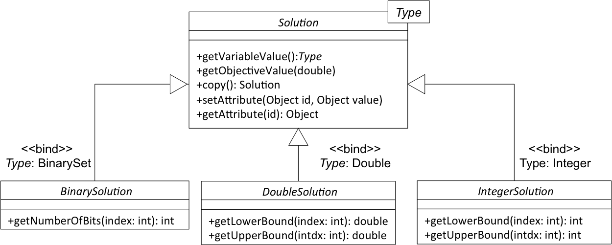

## `Solution`インターフェース
メタヒューリスティックを使用するときに最初に取らなければならない決定の1つは解決すべき問題の暫定的解決策をどのように符号化または表現するかを定義することである．表現は問題に強く依存し，適用可能な演算(例えば，他の解との再結合，局所探索手段など)を決定する．したがって，特定の表現を選択することは，メタヒューリスティックの振る舞い，ひいては得られた結果の室に大きな影響を与える．

次の図は，jMetal5のSolutionを表すために使用される基本コンポーネントを示している．



バイナリー，リアル，および整数の3つの表現が含まれている．このアプローチを使用することにより，同じエンコーディングに対して多くの実装を提供することができ，柔軟性がさらに向上する．ジェネリックの使用はまた，変数の値を誤って割り当てようとすると，コンパイルエラーを引き起こす．例えば，`DoubleSolution`の変数値をint変数に代入しようとしている．

次に，`Solution`インターフェースのコードを示す．

```java
package org.uma.jmetal.solution;

public interface Solution<T> extends Serializable {
  public void setObjective(int index, double value) ;
  public double getObjective(int index) ;

  public T getVariableValue(int index) ;
  public void setVariableValue(int index, T value) ;
  public String getVariableValueString(int index) ;

  public int getNumberOfVariables() ;
  public int getNumberOfObjectives() ;

  public Solution<T> copy() ;

  public void setAttribute(Object id, Object value) ;
  public Object getAttribute(Object id) ;
}
```

インターフェースには，ソリューションの変数と目的，コピー方法，およびソリューション属性にアクセスするためのメソッドの両方にアクセスするためのメソッドがある．

### エンコーディングの定義
特定のエンコーディングを定義することは，`Solution`インターフェースを実装または拡張することを意味する．このように，doubleおよびinteger変数のリストを持つ解のインターフェースは次のように定義される．

```java
package org.uma.jmetal.solution;

public interface DoubleSolution extends Solution<Double> {
  public Double getLowerBound(int index) ;
  public Double getUpperBound(int index) ;
}
```
```java
package org.uma.jmetal.solution;

public interface IntegerSolution extends Solution<Integer> {
  public Integer getLowerBound(int index) ;
  public Integer getUpperBound(int index) ;
}
```

これらのインターフェースは，doubleおよびinteger変数の下限および上限を取得する．これらの値を設定する方法は実装クラスに委ねられている．

バイナリソシューションの場合，インターフェースは次のようになる．

```java
import org.uma.jmetal.util.binarySet.BinarySet;

public interface BinarySolution extends Solution<BinarySet> {
  public int getNumberOfBits(int index) ;
  public int getTotalNumberOfBits() ;
}
```

バイナリ変数のリストを表現しようとしていると仮定する．

採用されたアプローチは，混合変数を有する符号化を定義することを可能にする．例えば，このインターフェースでは，double値とinteger値のリストで構成されるソリューションを定義する．

```java
package org.uma.jmetal.solution;

public interface IntegerDoubleSolution extends Solution<Number> {
  public Number getLowerBound(int index) ;
  public Number getUpperBound(int index) ;
  public int getNumberOfIntegerVariables() ;
  public int getNumberOfDoubleVariables() ;
}
```

### Solutionの実装
色々なソリューションのインターフェースを定義したら，それらの全てにデフォルトの実装を提供する．アプローチは`AbstractGenericSolution`という名前の抽象クラスを出発点として取ることである．

```java
package org.uma.jmetal.solution.impl;

public abstract class AbstractGenericSolution<T, P extends Problem<?>> implements Solution<T> {
  private double[] objectives;
  private List<T> variables;
  protected P problem ;
  protected double overallConstraintViolationDegree ;
  protected int numberOfViolatedConstraints ;
  protected Map<Object, Object> attributes ;
  protected final JMetalRandom randomGenerator ;
```

これは`Solution`の全てのメソッドに対する実装を含んでいる．このクラスは，`DefaultBinarySolution`, `DefaultIntegerSolution`, `DefaultDoubleSolution`, `DefaultIntegerDoubleSolution`, `DefaultIntegerPermutationSolution`, と `DefaultDoubleBinarySolution`の全てのソリューション実装によって拡張されている．

### Populationはどこに？
jMetal5には`Population`の概念を表すクラスはない．代わりに，`Solution`オブジェクトのJavaの`List`オブジェクトが使用される．

例:

``` java
/* A population of double solutions */
List<DoubleSolution> doublePopulation ;

/* The same population using the generic interface */
List<Solution<Double>> doublePopulation ;

/* A population of binary solutions */
List<BinarySolucion> binaryPopulation ;
```

[`SolutionListUtils`]（https://github.com/jMetal/jMetal/blob/master/jmetal-core/src/main/java/org/uma/jmetal/util/SolutionListUtils.java）と呼ばれるユーティリティクラスは、最適/最悪の解を見つける、ランダムに解を選択するなどの、解リストに対する操作の集合である．

### `Solution`の属性
属性を組み込むという考え方は，いくつかのアルゴリズムで必要とされるソリューションに特定のフィールドを追加できるようにすることである．例えば，NSGA-IIでは，解をランク付けしてcrowding distanceの値を割り当てる必要がありますが，SPEA2では生の適性を解に割り当てる．

属性は直接操作されるが，このユーティリティインタフェースも含まれている．

```java
package org.uma.jmetal.util.solutionattribute;
/**
 * Attributes allows to extend the {@link Solution} classes to incorporate data required by
 * operators or algorithms manipulating them.
 *
 * @author Antonio J. Nebro <antonio@lcc.uma.es>
 */
public interface SolutionAttribute <S extends Solution<?>, V> {
  public void setAttribute(S solution, V value) ;
  public V getAttribute(S solution) ;
  public Object getAttributeID() ;
}
```

デフォルト実装:

```java
package org.uma.jmetal.util.solutionattribute.impl;

public class GenericSolutionAttribute <S extends Solution<?>, V> implements SolutionAttribute<S, V>{

  @SuppressWarnings("unchecked")
  @Override
  public V getAttribute(S solution) {
    return (V)solution.getAttribute(getAttributeID());
  }

  @Override
  public void setAttribute(S solution, V value) {
     solution.setAttribute(getAttributeID(), value);
  }

  @Override
  public Object getAttributeID() {
    return this.getClass() ;
  }
}
```

現在の実装では，`getAttributeID()`はクラス識別子を返す．つまり，同じクラスの2つの異なる属性を持つことはできない．

### 属性の例:constraints
最適化問題には側面の制約がある．これは，解を評価するには，目的関数とある種の制約処理メカニズムを適用するための制約を計算する必要があることを意味する．jMetal5のソリューション属性は，制約情報をソリューションに組み込むために使用される．

jMetalのデフォルトの制約処理メカニズムは，NSGA-IIで定義されている全体の制約違反スキームであるため，次のクラスが用意されている．

```java
package org.uma.jmetal.util.solutionattribute.impl;
public class OverallConstraintViolation<S extends Solution<?>> extends GenericSolutionAttribute<S, Double> {
}
```

`GenericSolutionAttribute`を拡張した空のクラスで，属性のdouble値を指定する．通常，千木の例に示すように，制約をクラス定義で評価する．

```java
package org.uma.jmetal.problem.multiobjective;

/** Class representing problem Binh2 */
public class Binh2 extends AbstractDoubleProblem implements ConstrainedProblem<DoubleSolution> {
  public OverallConstraintViolation<DoubleSolution> overallConstraintViolationDegree ;
  public NumberOfViolatedConstraints<DoubleSolution> numberOfViolatedConstraints ;
  /**
   * Constructor
   * Creates a default instance of the Binh2 problem
   */
  public Binh2() {
    ...
    overallConstraintViolationDegree = new OverallConstraintViolation<DoubleSolution>() ;
    numberOfViolatedConstraints = new NumberOfViolatedConstraints<DoubleSolution>() ;
  }

  /** Evaluate() method */
  @Override
  public void evaluate(DoubleSolution solution) {
     ...
  }

  /** EvaluateConstraints() method */
  @Override
  public void evaluateConstraints(DoubleSolution solution)  {
    double[] constraint = new double[this.getNumberOfConstraints()];

    double x0 = solution.getVariableValue(0) ;
    double x1 = solution.getVariableValue(1) ;

    constraint[0] = -1.0 * (x0 - 5) * (x0 - 5) - x1 * x1 + 25.0;
    constraint[1] = (x0 - 8) * (x0 - 8) + (x1 + 3) * (x1 + 3) - 7.7;

    double overallConstraintViolation = 0.0;
    int violatedConstraints = 0;
    for (int i = 0; i < this.getNumberOfConstraints(); i++) {
      if (constraint[i] < 0.0) {
        overallConstraintViolation += constraint[i];
        violatedConstraints++;
      }
    }

    overallConstraintViolationDegree.setAttribute(solution, overallConstraintViolation);
    numberOfViolatedConstraints.setAttribute(solution, violatedConstraints);
  }
```

このコードには，与えられた解の違反した制約の数を設定するために使用される`NumberOfViolatedConstraints`という別の属性も含まれている．

### 属性の例: ranking
ソリューション属性の使用はカプセル化できる．一例として，ソリューションにランクを割り当てるためのインターフェース(NSGA-IIのランキング)を次のように定義した．

```java
package org.uma.jmetal.util.solutionattribute;

import java.util.List;

/**
 * Ranks a list of solutions according to the dominance relationship
 *
 * @author Antonio J. Nebro <antonio@lcc.uma.es>
 */
public interface Ranking<S extends Solution<?>> extends SolutionAttribute<S, Integer>{
  public Ranking<S> computeRanking(List<S> solutionList) ;
  public List<S> getSubfront(int rank) ;
  public int getNumberOfSubfronts() ;
}
```

クライアントクラス(NSGAクラス)は，単に以下を使用することができる．

```java
Ranking ranking = computeRanking(jointPopulation);
```

このようにして，ソリューション属性はランキングを実装するクラスによって内部的に管理され，メタヒューリスティックに隠される．
